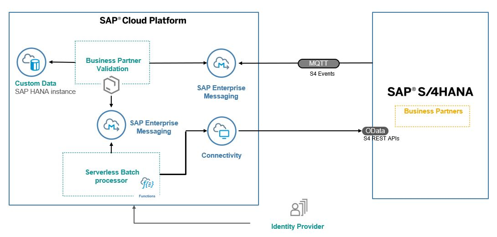

# S/4 HANA Extend Business Process Scenario

The main intent of this scenario is to complement an existing business process in an SAP solution – currently SAP S/4HANA, SAP SuccessFactors or selected SAP Cloud solutions - with additional business process steps. This involves adding major logic and/or additional data and goes beyond simple UI changes.

More details of extension scnearios can be dound [here](https://pages.github.tools.sap/sapcpextensions/).
Detailed steps of the S/4 HANA Extension Scenario can be found [here](https://github.wdf.sap.corp/refapps/cp-extension-scenarios/blob/master/s4-extend-business-process/Clickstream.xlsx?raw=true)

This application showcases:

- Building application on SAP Cloud Platform using SAP Cloud Application Programming Model(CAP)
- Consuming Events from S/4 HANA on premise using SAP CP Enterprise Messaging
- Consuming REST API's from S/4 HANA on premise using SAP CP Connectivity Service
- Serverless Runtime

# Business Scenario

A business scenario is used to showcase how to build a S/4 HANA onpremise extension Application.

As an employee of  Business Partner Validation Firm iCredible, which is a third party vendor of ACME Corporation, John would like to get notifications when ever new Business Partners are added in the S/4 HANA backend system of ACME Corporation. John would then be able to review the Business Partner Details in his extension app. He would then proceed to visit the Business Partner’s registered office take a picture, do some background verification. John would then proceed to update the verification details and also upload an image of the Business Partner’s registered office into the extension app. Once the details are verified and image is uploaded then, the Business Partner gets activated in the S/4 HANA system of ACME Corporation.

# Architecture

## Solution Diagram

The Business Partner Validation application is developed using [SAP Cloud Application programming Model (CAP)](https://cap.cloud.sap/docs/) and runs and runs on the SAP Cloud Platform Cloud Foundry Environment. It consumes platform services like Enterprise Messaging, SAP HANA and Connectivity. The events generated in S/4 HANA on preimse  are inserted into the Enterprise messaging queue. The application running in Cloud Foundry polls the queue for these messages and inserts them into the HANA database. The Business Partner Validation Application also uses S/4 HANA REST API's to read data from Business Partner Data from S/4 HANA system. The Business Partner Validation App also places the processed events into a Enterprise Message Queue from where a Serverless Application consumes it and posts it back to S/4 HANA onpremise system

# Configuration

## Entitlements

The application requires below set of SAP Cloud Platform Entitelements/Quota

| Service                           | Plan       | Number of Instances |
|-----------------------------------|------------|:-------------------:|
| Destination                       | lite       |          1          |
| Enterprise Messaging              | default    |          1          |
| SAP HANA Schemas & HDI Containers | hdi-shared |          1          |
| SAP Hana Service                  | 64standard |          1          |
| Application Runtime               |            |          3          |
| Extension Factory Runtime         |            |          1          |

## Project Structure

The project contains below folders and files

File / Folder | Purpose
---------|----------
`app/` | content for UI frontends go here
`db/` | your domain models and data go here
`srv/` | your service models and code go here
`package.json` | project metadata and configuration
`readme.md` | this getting started guide

## Steps to deploy locally

- Open a new terminal and run  `cds watch`
- ( in VSCode simply choose _**Terminal** > Run Task > cds watch_ )
- Start adding content, e.g. a [db/schema.cds](db/schema.cds), ...

## Serverless application
- Deploy the serverless application from here https://github.wdf.sap.corp/refapps/RefappBpAggregator

